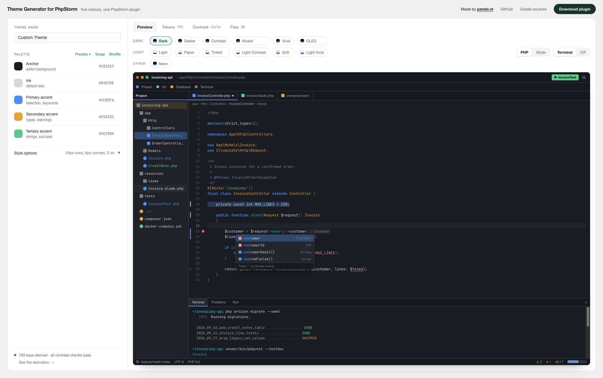

# phpstorm-theme-generator

[phpstorm-theme-generator.com](https://phpstorm-theme-generator.com)

A theme generator for PhpStorm and every other IntelliJ-based IDE (IntelliJ
IDEA, WebStorm, PyCharm, Rider, GoLand…). Pick five colours and get a
complete, installable JetBrains theme plugin: editor colour scheme, syntax
highlighting, full IDE UI, terminal ANSI colours, VCS and diff colours, and
optional file icons — in eight variants (dark, light, high contrast, OLED,
neon and more), all checked for WCAG contrast.

Keywords: PhpStorm theme generator, JetBrains theme builder, IntelliJ colour
scheme maker, custom IDE theme, dark theme, `.theme.json`, `.icls`.



## Use it

**[phpstorm-theme-generator.com](https://phpstorm-theme-generator.com)** —
runs entirely in your browser; nothing is uploaded. Download the plugin zip and
install it with **Settings → Plugins → ⚙ → Install Plugin from Disk**.

There is also a CLI:

```bash
npx phpstorm-theme-generator --name "Acme" "#1B1D23" "#D4D7DE" "#4C8DF6" "#E5A33C" "#5CC98A"
```

## Run and edit locally

Needs Node 20 or newer. No bundler, no framework.

```bash
git clone https://github.com/PendoNL/phpstorm-theme-generator.git
cd phpstorm-theme-generator
npm install

npm run dev       # http://localhost:8080, live ES modules
npm test          # colour maths, contrast floors, emitters, zip, UI smoke
npm run build     # dist/index.html, one self-contained file
```

The generator lives in `src/lib` (shared by the site and the CLI), the site in
`src/ui`. `docs/SPEC.md` documents every theme key.

Pull requests with new features are welcome — see
[CONTRIBUTING.md](CONTRIBUTING.md).

## Licence: free, and it stays free

The generator exists because themes should be a five-minute job, not a
product. The licence says the same thing:

- **The code** is under the [PolyForm Noncommercial License 1.0.0](LICENSE).
  Use it, change it, share it — but not to make money. No selling it, no paid
  hosting of it, no bundling it into a paid product.
- **The themes** — the presets here and every theme you generate — are under
  [CC BY-NC-SA 4.0](https://creativecommons.org/licenses/by-nc-sa/4.0/). **If
  you publish one, on the JetBrains Marketplace or anywhere else, it has to be
  free of charge.** Give credit, and keep the same terms on anything you build
  from it. Each generated plugin carries these terms in its `LICENSE.txt`.

Using a theme at your job is fine. Selling it, or anything built from it, is
not.

## Made by

[Pendo](https://pendo.nl/?utm_campaign=tools&utm_source=github&utm_medium=readme&utm_content=textlink). Licensed for noncommercial use — see [LICENSE](LICENSE). The optional
icon sets (Heroicons, Bootstrap Icons, Tabler Icons) are MIT licensed by their
own authors; their notices ship inside every plugin that uses them.

If this saved you time, you can
[sponsor Pendo on GitHub](https://github.com/sponsors/PendoNL).

Not affiliated with or endorsed by JetBrains. "PhpStorm", "IntelliJ" and
"JetBrains" are trademarks of JetBrains s.r.o.
